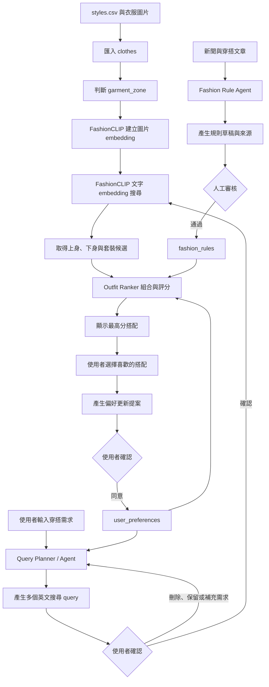

# Matching Outfit

以自然語言拆解穿搭需求，使用 FashionCLIP 做文字對圖片搜尋，再將候選衣服組成搭配的開發骨架。

## 技術架構

- Frontend: Vue 3 + TypeScript + Vite
- Backend: FastAPI + SQLAlchemy
- Database: PostgreSQL 16 + pgvector
- Migration: Alembic
- Embedding: `patrickjohncyh/fashion-clip`（512 維、cosine distance）

目前 Query Planner 是不需 API key 的規則版，介面已獨立放在 `backend/app/services/query_planner.py`，之後可以直接替換成 LLM agent。搭配排序目前以 embedding 相似度為基礎，`fashion_rules` 與完整 user preference 加權是後續開發接點。

## 系統預計流程

系統分成「衣服資料準備」、「使用者推薦流程」和「穿搭規則更新」三個部分。



### 1. 衣服資料準備

1. 將 Kaggle 的 `styles.csv` 與 `{id}.jpg` 圖片放進 `data/`。
2. 匯入工具依 `articleType` 和 `subCategory` 判斷 `garment_zone`。
3. 衣服 metadata、圖片路徑、圖片 URL、價格及 zone 寫入 `clothes`。
4. FashionCLIP 將每張圖片轉成 512 維 embedding，存入 PostgreSQL `pgvector` 欄位。
5. 後續新增圖片時，只匯入新資料並替尚未建立向量的衣服產生 embedding。

### 2. 使用者推薦流程

1. 使用者輸入場合、風格、顏色、預算或不想要的項目。
2. Query Planner 參考輸入內容與 `user_preferences`，拆成多個英文 query，並標記搜尋的 `garment_zone`。
3. 使用者可以保留、刪除 query，或補充「還要什麼／不要什麼」後重新拆解。
4. 使用者確認後，FashionCLIP 將 query 轉成文字 embedding。
5. 系統在相同 `garment_zone` 中，以 cosine distance 搜尋最接近的衣服圖片：
   - `upper_body` query 只搜尋上半身衣服。
   - `lower_body` query 只搜尋下半身衣服。
   - `one_piece` query 只搜尋洋裝或連身服。
6. Outfit Ranker 將上身與下身候選配對，`one_piece` 則直接作為完整搭配候選。
7. 預計使用 embedding 相似度、`fashion_rules`、使用者偏好、價格與場合適合度計算總分。
8. 前端顯示最高分的幾組上下身搭配或單件套裝。
9. 使用者選擇喜歡的衣服後，系統先提出偏好更新內容；只有使用者確認後才寫入 `user_preferences`。

### 3. 穿搭規則更新流程

1. Fashion Rule Agent 定期讀取新聞或穿搭文章。
2. Agent 將文章整理成固定欄位的規則草稿，並保留 `source_url`、發布時間和適用條件。
3. 規則先經人工審核，通過後才設為 `is_active=true`。
4. Outfit Ranker 只使用已啟用的規則參與搭配評分。

### 目前實作狀態

- 已完成：CSV 與圖片匯入、garment zone 分類、圖片 embedding、文字 embedding 搜尋、query 確認介面、基本上下身配對、偏好更新提案與確認。
- 骨架階段：Query Planner 目前是關鍵字規則版，尚未串接 LLM。
- 待開發：`fashion_rules` 實際評分、完整 user preference 權重、新聞爬取與規則更新 Agent、更完整的搭配相容性模型。

## 啟動服務

```bash
docker compose up --build
```

- Frontend: http://localhost:5173
- API docs: http://localhost:8000/docs
- API health: http://localhost:8000/health
- PostgreSQL: `localhost:5432`

Backend 啟動前會自動執行 `alembic upgrade head`。這次 initial migration 已重建；若你曾用舊版 schema 建立 Docker volume，請先執行：

```bash
docker compose down -v
docker compose up --build
```

## 放置 Kaggle 資料

下載 [Fashion Product Images Dataset](https://www.kaggle.com/datasets/paramaggarwal/fashion-product-images-dataset) 並整理成以下結構：

```text
data/
├── styles.csv
└── images/
    ├── 1163.jpg
    ├── 1164.jpg
    └── ...
```

重點是 CSV 的 `id` 必須對應到 `images/{id}.jpg`。Docker 會把整個 `data/` 唯讀掛載到 backend 的 `/data/`。

## 匯入衣服資料

先測試 100 筆，未提供價格的 Kaggle 資料會暫時填入整數 `1000`：

```bash
docker compose exec backend python -m scripts.import_catalog \
  --csv /data/styles.csv \
  --image-dir /data/images \
  --default-price 1000 \
  --limit 100
```

確認後移除 `--limit 100` 即可匯入全部。重複執行會依 `source_item_id` 更新，不會建立重複衣服。

匯入工具會填入：

- Kaggle 欄位：`gender`、`master_category`、`sub_category`、`article_type`、`base_colour`、`season`、`year`、`usage`、`product_display_name`
- `source_item_id`: Kaggle `id`
- `price`: 目前由 `--default-price` 指定，之後可換成真實價格
- `image_path`: backend 讀圖使用，例如 `/data/images/1163.jpg`
- `image_url`: 前端顯示使用，例如 `/media/1163.jpg`
- `garment_zone`: 依 article type/subcategory 自動分為 `upper_body`、`lower_body`、`one_piece`、`accessory`、`other`

分類規則位於 `backend/app/services/garment_classifier.py`。正式匯入前建議先抽樣確認，因為 Kaggle 類別中還有印度服飾等需要依產品定義調整的項目。

## 資料表

- `clothes`: 商品 metadata、圖片位置、衣服區域、價格與 512 維 embedding。
- `user_preferences`: 喜歡／不喜歡的顏色、價位、風格、用途與品類。
- `fashion_rules`: 固定格式的穿搭規則、適用條件、來源、權重與人工審核時間。

`fashion_rules.conditions` 先使用 JSON 保存固定條件，例如：

```json
{
  "upper_colors": ["navy"],
  "lower_colors": ["beige", "white"],
  "occasion": ["office"],
  "avoid_article_types": ["track pants"]
}
```

新聞蒐集 agent 後續應只建立或更新規則草稿，保留 `source_url`、`published_at` 與 `reviewed_at`，並在人工確認後才設為 `is_active=true`。
