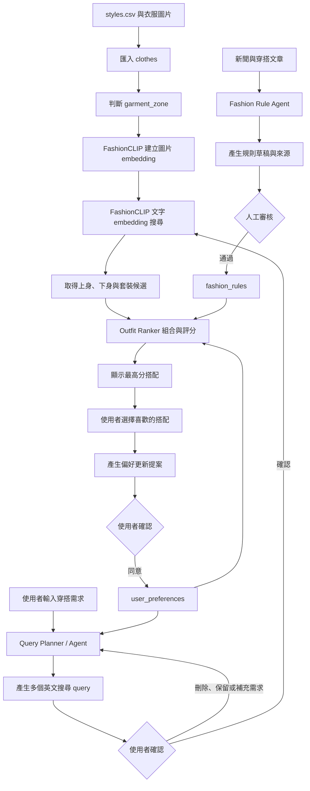

# Matching Outfit

以自然語言拆解穿搭需求，使用 FashionCLIP 做文字對圖片搜尋，再將候選衣服組成搭配的開發骨架。

## 技術架構

- Frontend: Vue 3 + TypeScript + Vite
- Backend: FastAPI + SQLAlchemy
- Database: PostgreSQL 16 + pgvector
- Migration: Alembic
- Embedding: `patrickjohncyh/fashion-clip`（512 維、cosine distance）
- Virtual try-on: 獨立 CatVTON GPU API + 私有 MinIO

目前商品 Query Planner 仍是不需 API key 的規則版。另有「文章知識 → 搭配策略 → FashionCLIP 商品候選」流程：Styling Planner 先產生三套搭配公式與各 garment zone 的英文視覺 query，Critic 檢查並最多修訂一次，再由 FashionCLIP 搜尋實際商品，最後交給 Outfit Ranker 排序。

## 系統預計流程

系統分成「衣服資料準備」、「使用者推薦流程」和「穿搭規則更新」三個部分。



### 1. 衣服資料準備

1. 將 Kaggle 的 `styles.csv` 與 `{id}.jpg` 圖片放進 `data/`。
2. 匯入工具依 `articleType` 和 `subCategory` 判斷 `garment_zone`。
3. 衣服 metadata、圖片路徑、圖片 URL、價格及 zone 寫入 `clothes`。
4. FashionCLIP 將每張圖片轉成 512 維 embedding，存入 PostgreSQL `pgvector` 欄位。
5. 後續新增圖片時，只匯入新資料並替尚未建立向量的衣服產生 embedding。

### 2. 使用者推薦流程

1. 使用者輸入場合、風格、顏色、預算或不想要的項目。
2. Query Planner 參考輸入內容與 `user_preferences`，拆成多個英文 query，並標記搜尋的 `garment_zone`。
3. 使用者可以保留、刪除 query，或補充「還要什麼／不要什麼」後重新拆解。
4. 使用者確認後，FashionCLIP 將 query 轉成文字 embedding。
5. 系統在相同 `garment_zone` 中，以 cosine distance 搜尋最接近的衣服圖片：
   - `upper_body` query 只搜尋上半身衣服。
   - `lower_body` query 只搜尋下半身衣服。
   - `one_piece` query 只搜尋洋裝或連身服。
6. Outfit Ranker 將上身與下身候選配對，`one_piece` 則直接作為完整搭配候選。
7. 預計使用 embedding 相似度、`fashion_rules`、使用者偏好、價格與場合適合度計算總分。
8. 前端顯示最高分的幾組上下身搭配或單件套裝。
9. 使用者選擇喜歡的衣服後，系統先提出偏好更新內容；只有使用者確認後才寫入 `user_preferences`。

### 3. 穿搭規則更新流程

1. Fashion Rule Agent 定期讀取新聞或穿搭文章。
2. Agent 將文章整理成固定欄位的規則草稿，並保留 `source_url`、發布時間和適用條件。
3. 規則先經人工審核，通過後才設為 `is_active=true`。
4. Outfit Ranker 只使用已啟用的規則參與搭配評分。

第一版不把雜誌內容直接寫成永久真理，也不自動啟用 `fashion_rules`。文章先存成 `data/articles/records/*.json` 的 `outfit observations`，每一筆保留來源、證據、適用情境、單品、顏色、材質、輪廓、搭配動作、時效類型與信心分數。待格式穩定且經人工抽查後，再決定哪些內容值得晉升成資料庫規則。

### 目前實作狀態

- 已完成：CSV 與圖片匯入、garment zone 分類、圖片 embedding、文字 embedding 搜尋、query 確認介面、基本上下身配對、偏好更新提案與確認。
- 骨架階段：Query Planner 目前是關鍵字規則版，尚未串接 LLM。
- 已完成 MVP：指定 URL 文章收集、圖片與文字的 LLM 結構化整理、簡易相關觀察檢索、文字 Styling Planner、Critic 與單次修訂。
- 已完成 MVP：搭配公式會轉成 `upper_body`、`lower_body`、`one_piece` 或 `accessory` 的 FashionCLIP query，召回實際商品後再組合；Outfit Ranker 也會使用現有的顏色、品類與價格偏好做輕量加減分。
- 待開發：`fashion_rules` 實際評分、陳枝宣後續提供的材質／版型／圖案等衣服 tag、完整 user preference 權重、整套商品圖片的視覺審查、更完整的搭配相容性模型。

## 啟動服務

```bash
docker compose up --build
```

- Frontend: http://localhost:5173
- API docs: http://localhost:8000/docs
- API health: http://localhost:8000/health
- PostgreSQL: `localhost:5432`

一般網站 stack 不會啟動 CatVTON 或 MinIO。未設定遠端 GPU API 時，虛擬試穿分頁會顯示服務尚未連線，其餘功能可正常使用。

## 虛擬試穿部署

CatVTON 與 MinIO 有獨立的 Compose stack，位於 `catvton/`。它不使用或連接 Matching Outfit 的 PostgreSQL；MinIO 只存在於 CatVTON 私有 Docker network，保存排隊中的輸入、job manifest 與生成結果。

在 NVIDIA Linux 主機上設定：

```bash
cd catvton
cp .env.example .env
# 編輯 .env，替換 CATVTON_API_KEY、MINIO_ROOT_USER、MINIO_ROOT_PASSWORD
docker compose up --build -d
```

CatVTON API 預設監聽 `9002`。MinIO API 不發布到主機；管理 console 只綁定 `127.0.0.1:9001`，需要遠端管理時可透過 SSH tunnel 使用。

第一次啟動會從 Hugging Face 下載 CatVTON、DensePose、SCHP 與 base model，需等待模型下載及載入完成。健康檢查需要 API key：

```bash
curl -H "X-API-Key: $CATVTON_API_KEY" http://127.0.0.1:9002/health
```

網站主機透過私有網路或 VPN 設定同一組 secret：

```bash
cp .env.example .env
# CATVTON_API_URL=http://<GPU_PRIVATE_IP>:9002
# CATVTON_API_KEY=<與 GPU 主機相同的 secret>
docker compose up --build -d
```

人物照與衣服照由 CatVTON 在工作結束後立即從 MinIO 刪除；結果與 manifest 保存 24 小時。Matching Outfit backend 只保存本地 job metadata 和遠端 job UUID，前端不會取得 MinIO 帳密或 CatVTON API key。

Backend 啟動前會自動執行 `alembic upgrade head`。這次 initial migration 已重建；若你曾用舊版 schema 建立 Docker volume，請先執行：

```bash
docker compose down -v
docker compose up --build
```

## 少量文章 → 穿搭知識

1. 複製環境設定並填入 API key：

```bash
cp .env.example .env
```

2. 複製 `data/article_urls.example.txt`，先挑 8–12 篇公開且能直接閱讀的文章，一行一個 URL。第一版只接受設定中的 ELLE Taiwan、GQ Taiwan、Marie Claire Korea 與 GQ Korea 網域，不會從分類頁自動無限追蹤連結。

3. 先只測試網頁解析，不花 LLM 用量：

```bash
docker compose run --rm backend python -m scripts.collect_articles \
  --url-file /data/article_urls.example.txt \
  --collect-only
```

4. 確認 `data/articles/raw/` 內容合理後，再下載每篇最多 4 張圖片並抽取穿搭觀察：

```bash
docker compose run --rm backend python -m scripts.collect_articles \
  --url-file /data/article_urls.example.txt \
  --download-images \
  --max-images 4
```

收集器預設遵守 `robots.txt`、限制允許網域，也不處理登入或付費牆。網站條款與頁面結構仍可能改變；失敗的文章會個別列出，不會偷偷換來源。原始文章、衍生 JSON 和下載圖片都被 `.gitignore` 排除，不會塞進 Git。

## 執行文字搭配 Demo

CLI：

```bash
docker compose run --rm backend python -m scripts.demo_styling \
  "去海邊度假三天，天氣炎熱，希望清爽好看但不要太暴露"
```

API：

```bash
curl -X POST http://localhost:8000/api/styling/demo \
  -H "Content-Type: application/json" \
  -d '{"user_input":"去晚宴，希望低調有質感","top_k_observations":8,"revise_once":true}'
```

可用 `GET /api/fashion-knowledge/status` 查看已整理的文章和觀察數量。`/api/styling/demo` 只輸出文字公式；若要進一步搜尋 Kaggle／實際衣櫃商品，使用下面的 `/api/styling/recommendations`。

## 搭配 Agent + FashionCLIP 商品推薦

`POST /api/styling/recommendations` 會執行完整 MVP pipeline：

1. 讀取相關文章觀察與 `user_preferences`。
2. Agent 產生三套搭配公式，以及各部位的英文 FashionCLIP query。
3. FashionCLIP 在相同 `garment_zone` 中搜尋少量圖片候選。
4. Outfit Ranker 組合上下身、洋裝與可選配件。
5. 以 FashionCLIP 相似度為基礎，再加入現有的顏色、品類與價格偏好分數。

```bash
curl -X POST http://localhost:8000/api/styling/recommendations \
  -H "Content-Type: application/json" \
  -d '{
    "user_input":"去海邊度假，希望清爽好看但不要太暴露",
    "user_key":"demo-user",
    "top_k_observations":8,
    "candidates_per_zone":8,
    "outfits_per_formula":3,
    "revise_once":true
  }'
```

這個 endpoint 需要先匯入衣服並執行 `scripts.build_embeddings`，也需要 `OPENAI_API_KEY`。如果資料庫中沒有任何衣服 embedding，API 會先回傳 409，避免先花 LLM 用量才發現沒有商品可搜尋。

## 放置 Kaggle 資料

如果不想人工挑選，也不想把 15 GB 高畫質資料下載到本機，可以先在 Kaggle Notebook 執行 `scripts.curate_catalog`。它會以 metadata、圖片品質、FashionCLIP、去重與多樣性 quota 全自動選出約 500 件，再只複製入選 ID 的高畫質圖。完整操作見 [`docs/KAGGLE_CURATION.md`](docs/KAGGLE_CURATION.md)。

下載 [Fashion Product Images Dataset](https://www.kaggle.com/datasets/paramaggarwal/fashion-product-images-dataset) 並整理成以下結構：

```text
data/
├── styles.csv
└── images/
    ├── 1163.jpg
    ├── 1164.jpg
    └── ...
```

重點是 CSV 的 `id` 必須對應到 `images/{id}.jpg`。Docker 會把整個 `data/` 唯讀掛載到 backend 的 `/data/`。

## 匯入衣服資料

先測試 100 筆，未提供價格的 Kaggle 資料會暫時填入整數 `1000`：

```bash
docker compose exec backend python -m scripts.import_catalog \
  --csv /data/styles.csv \
  --image-dir /data/images \
  --default-price 1000 \
  --limit 100
```

確認後移除 `--limit 100` 即可匯入全部。重複執行會依 `source_item_id` 更新，不會建立重複衣服。

匯入工具會填入：

- Kaggle 欄位：`gender`、`master_category`、`sub_category`、`article_type`、`base_colour`、`season`、`year`、`usage`、`product_display_name`
- `source_item_id`: Kaggle `id`
- `price`: 目前由 `--default-price` 指定，之後可換成真實價格
- `image_path`: backend 讀圖使用，例如 `/data/images/1163.jpg`
- `image_url`: 前端顯示使用，例如 `/media/1163.jpg`
- `garment_zone`: 依 article type/subcategory 自動分為 `upper_body`、`lower_body`、`one_piece`、`accessory`、`other`

分類規則位於 `backend/app/services/garment_classifier.py`。正式匯入前建議先抽樣確認，因為 Kaggle 類別中還有印度服飾等需要依產品定義調整的項目。

## 資料表

- `clothes`: 商品 metadata、圖片位置、衣服區域、價格與 512 維 embedding。
- `user_preferences`: 喜歡／不喜歡的顏色、價位、風格、用途與品類。
- `fashion_rules`: 固定格式的穿搭規則、適用條件、來源、權重與人工審核時間。

`fashion_rules.conditions` 先使用 JSON 保存固定條件，例如：

```json
{
  "upper_colors": ["navy"],
  "lower_colors": ["beige", "white"],
  "occasion": ["office"],
  "avoid_article_types": ["track pants"]
}
```

新聞蒐集 agent 後續應只建立或更新規則草稿，保留 `source_url`、`published_at` 與 `reviewed_at`，並在人工確認後才設為 `is_active=true`。
